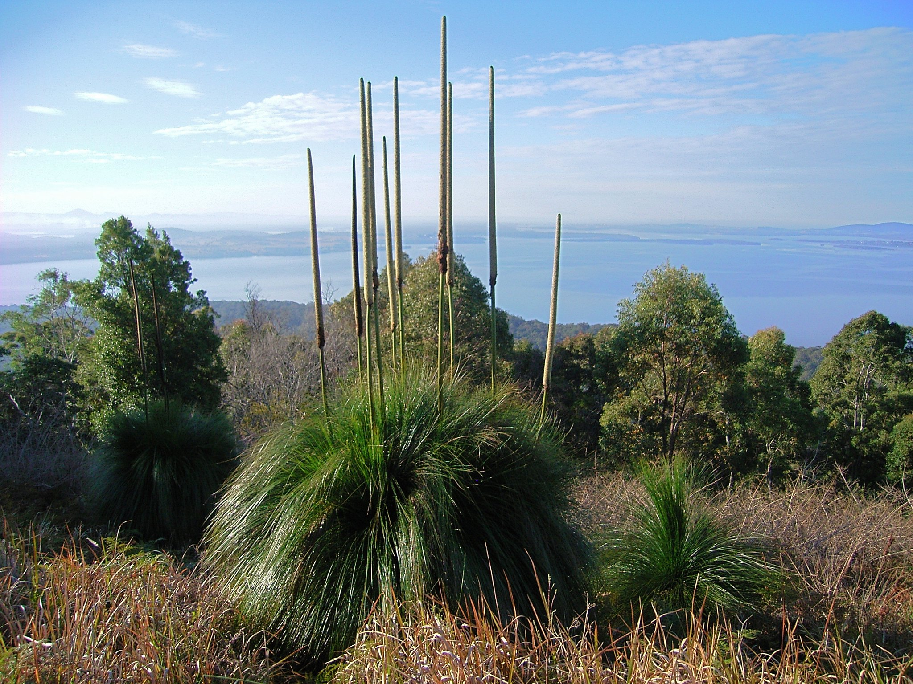

## To do:

* Add in linked webpages for edible plants (e.g. Leptomeria acida) and medicinal plants (e.g. Crinum pendunculatum). 

* Finish menu down to orders. 

* Finish menu down to families. 

* Add in Phylogeny. 
