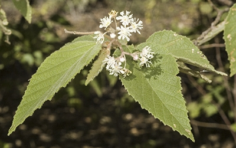

# *Androcalva*

* ~31 species
* First described in 2011 to comprise species previously in *Commersonia* (22) and *Rulingia* (4), as well as 7 new species

### *Androcalva fraseri* (Brush Kurrajong)

