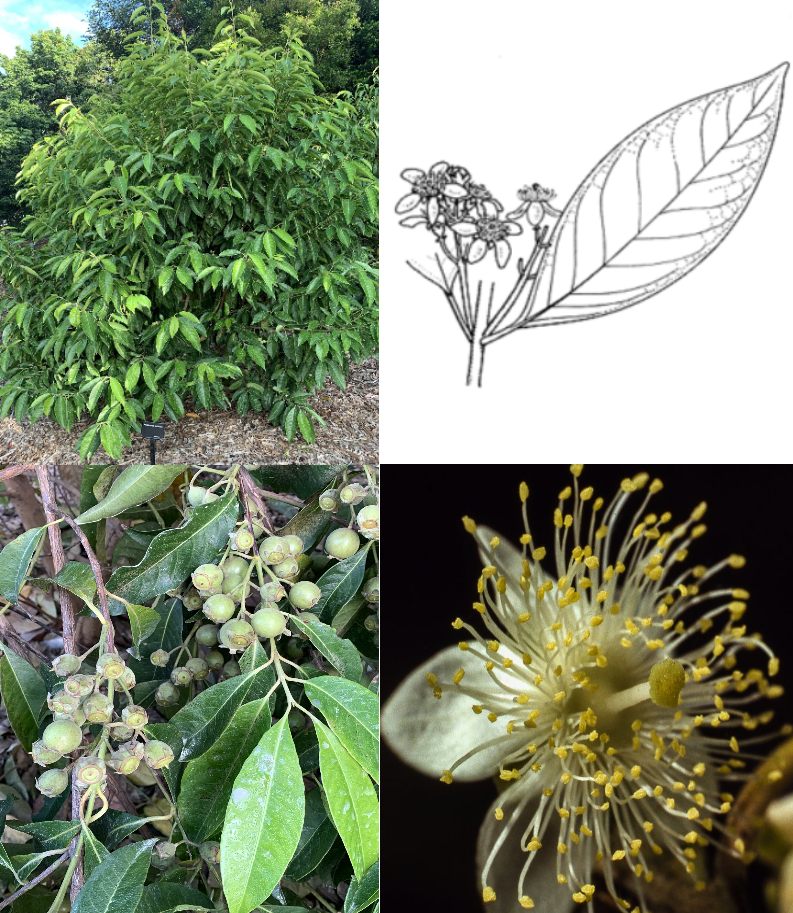

# *Rhodomyrtus*

* ~ 21 species (though probably polyphyletic)
* Native to Australasia, Southern China, and the Indian Subcontinent
* Rainforest trees and shrubs

### *Rhodomyrtus psidioides* (Native Guava)

