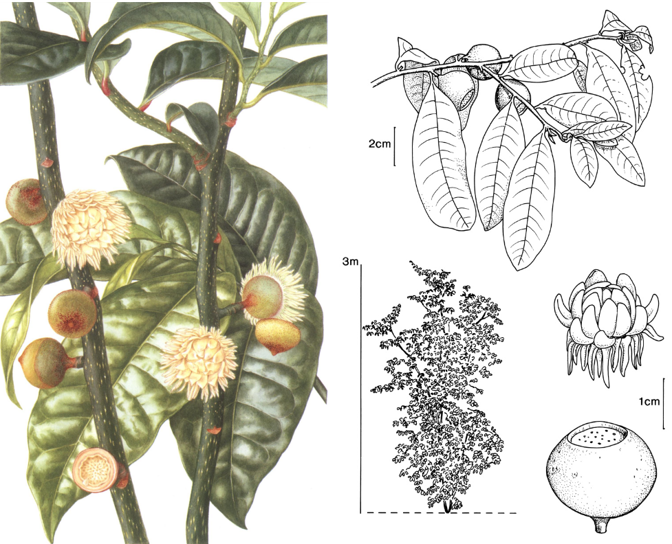

# Eupomatia

* 3 species
* Rainforest or humid eucalypt forest shrubs or small trees

## *Eupomatia laurina* (Bolwarra)

* Native to Eastern Australia and New Guinea

## *Eupomatia bennetti* (Small bolwarra)

* Endemic to NE NSW and SE QLD

## *Eupomatia barbata* (Northern small bolwarra)

* Endemic to NE QLD