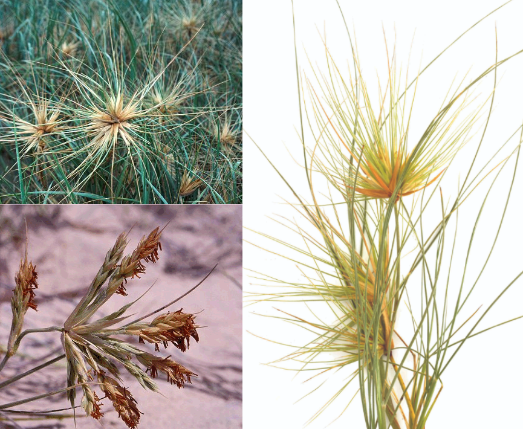

# Spinifex

* ~ 5 species 
* Native range Australia and SW Pacific to Tropical and Subtropical Asia.
* Perennial coastal grasses

## *Spinifex sericeus* (Beach/Coastal Spinifex)

Image: Female infloresence and leaves (top left, right), male infloresence (bottom left).

## *Spinifex hirsutus* (Hairy Spinifex)